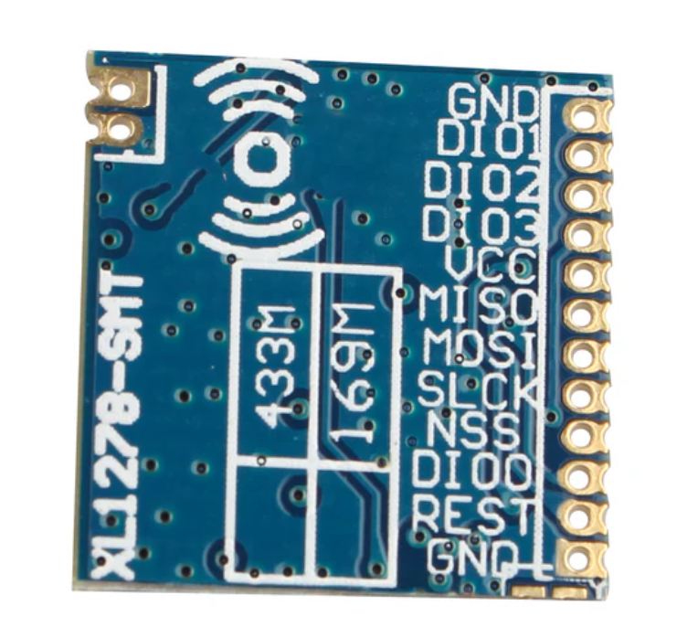
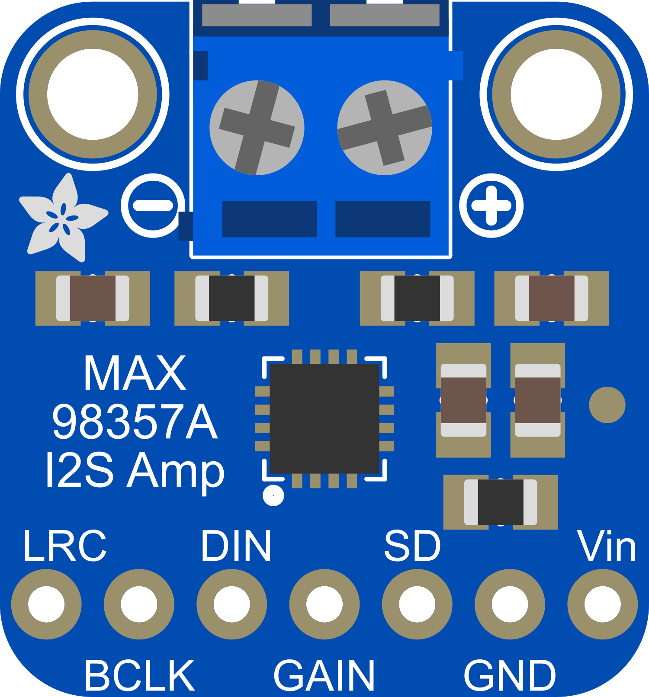
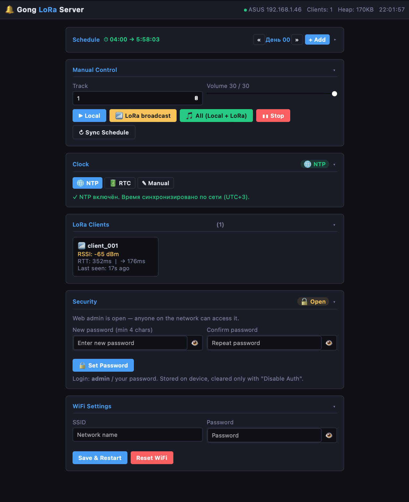
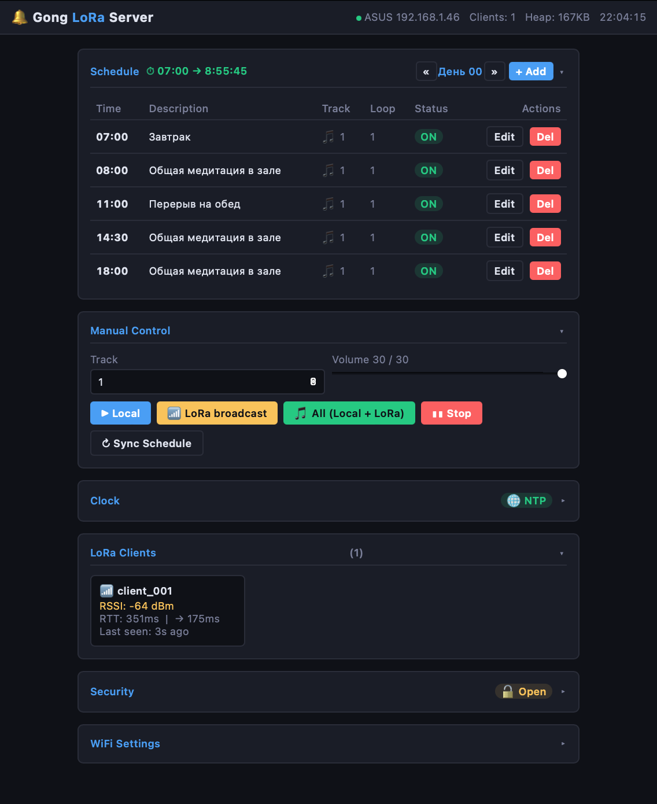
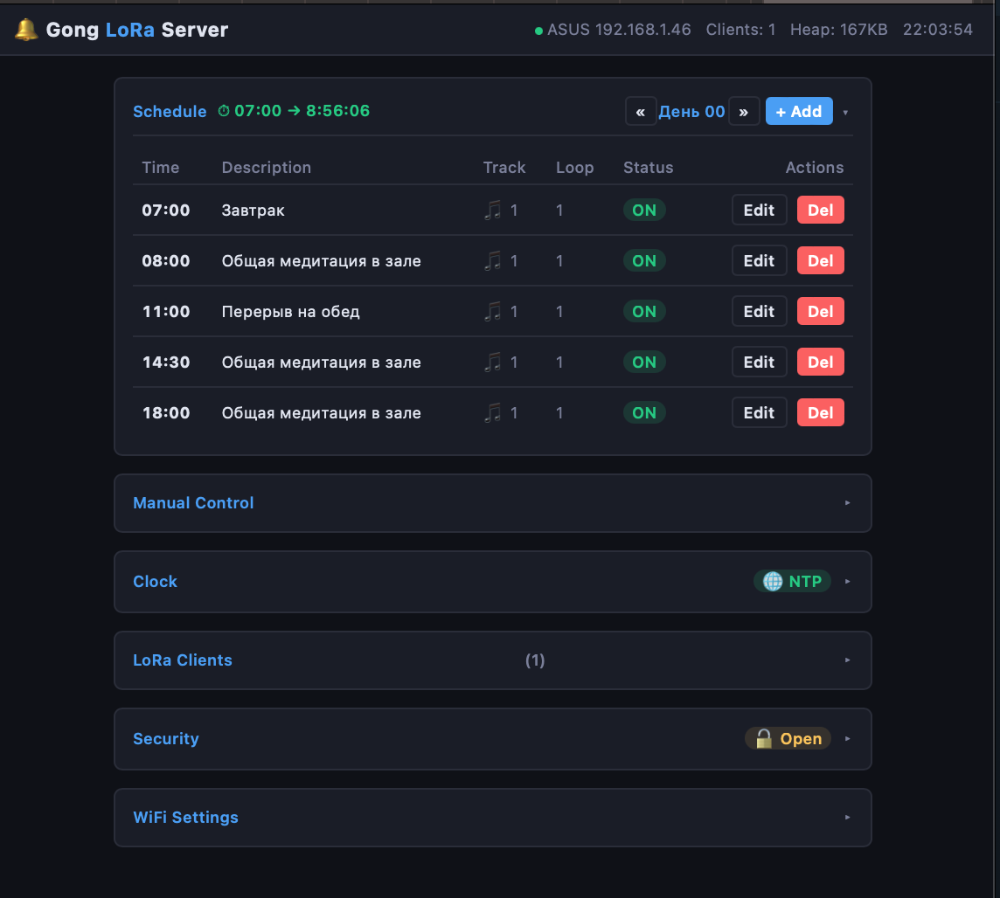

# Gong LoRa System

Система звонков на ESP32 с LoRa-сетью. **Один сервер** управляет расписанием и рассылает команды, **любое количество клиентов** слушают и воспроизводят звук одновременно.

```
[ Server ESP32 ]  ── LoRa 433 MHz ──>  [ Client ESP32 ] x N
  WiFi + Web UI                          MP3 playback
  Schedule / NTP                         ACK to server
  REST API
```

---

## Архитектура

| | Server | Client |
|---|---|---|
| WiFi | ✅ STA (или AP fallback) | ❌ не нужен |
| Web UI | ✅ http://ESP32_IP/ | ❌ |
| LoRa | ✅ отправляет | ✅ слушает |
| MP3 | ✅ играет локально | ✅ играет по команде |
| NTP | ✅ синхронизация | ❌ |
| ACK | ❌ | ✅ отправляет серверу |

---

## LoRa протокол

Каждое сообщение: `[1 байт тип][JSON payload]`

| Тип | Hex | Направление | JSON пример |
|-----|-----|-------------|-------------|
| GONG | `0x01` | Server → Clients | `{"track":1,"vol":25,"loop":3,"ts":12345}` |
| HEARTBEAT | `0x02` | Server → Clients | `{"time":"08:00:15","clients":3}` |
| SCHEDULE | `0x03` | Server → Clients | `[{"id":1,"hour":8,"min":0,...}]` |
| ACK | `0x04` | Client → Server | `{"id":"client_001","rssi":-52}` |
| STOP | `0x05` | Server → Clients | `{}` |

---

## Железо

### Компоненты

| Компонент | Сервер | Клиент |
|-----------|--------|--------|
| МК | ESP32 DevKit | ESP32 DevKit |
| LoRa | SX1278 433 МГц | SX1278 433 МГц |
| Аудио | MAX98357A (I2S) | MAX98357A (I2S) |
| MP3-файлы | SPIFFS (`/0001.mp3` …) | SPIFFS (`/0001.mp3` …) |
| Динамик | 4–8 Ω | 4–8 Ω |
| RTC *(опционально)* | DS3231 (I2C, CR2032) | — |

### Распиновка — SERVER (ESP32 + LoRa + MAX98357A + DS3231)


```
ESP32          LoRa SX1278          (VSPI, RadioLib)
GPIO5   ──── NSS / CS
GPIO14  ──── RST
GPIO2   ──── DIO0
GPIO18  ──── SCK
GPIO19  ──── MISO
GPIO23  ──── MOSI
3.3V    ──── VCC
GND     ──── GND

ESP32          MAX98357A            (I2S)
GPIO26  ──── BCLK  (Bit Clock)
GPIO25  ──── LRC   (Word Select)
GPIO33  ──── DIN   (Data In)
5V      ──── VDD
GND     ──── GND
3.3V    ──── SD

ESP32          DS3231               (I2C, опционально)
GPIO21  ──── SDA
GPIO22  ──── SCL
3.3V    ──── VCC
GND     ──── GND
               [батарейка CR2032 на модуле]
```
### Распиновка — CLIENT (ESP32 + LoRa + MAX98357A)


```
ESP32          LoRa SX1278          (VSPI, RadioLib)
GPIO5   ──── NSS / CS
GPIO14  ──── RST
GPIO2   ──── DIO0
GPIO18  ──── SCK
GPIO19  ──── MISO
GPIO23  ──── MOSI
3.3V    ──── VCC
GND     ──── GND

ESP32          MAX98357A            (I2S)
GPIO26  ──── BCLK  (Bit Clock)
GPIO25  ──── LRC   (Word Select)
GPIO33  ──── DIN   (Data In)
5V      ──── VDD
GND     ──── GND
3.3V    ──── SD
```

### LoRa RF-параметры (сервер и клиент должны совпадать)

| Параметр | Значение |
|----------|----------|
| Частота | 433 МГц |
| Spreading Factor | SF7 |
| Bandwidth | 125 кГц |
| Coding Rate | 4/5 |
| Sync Word | `0xF3` |
| TX Power | 20 дБм |

---

## Прошивка

### Server

```bash
cd server
# 1. Настрой WiFi (edit config.h -> AP_SSID/AP_PASSWORD или через веб)
# 2. Собери и залей прошивку:
pio run -t upload
# 3. Залей веб-интерфейс в SPIFFS:
pio run -t uploadfs
```

**Два MP3 общим объёмом ~2 МБ:** в проекте включена таблица разделов `partitions_large_spiffs.csv` (SPIFFS ~2.5 МБ, без OTA). Положи в `server/data/` файлы `0001.mp3` и `0002.mp3`, затем `pio run -t uploadfs`. Убедись, что размер папки `data/` не превышает ~2.4 МБ.

### Clients

Для каждого клиента:
1. Открой `client/src/config.h`
2. Измени `CLIENT_ID` на уникальное имя (например `"room_A"`, `"room_B"`)
3. Положи MP3-файлы в `client/data/` (`0001.mp3`, `0002.mp3` …)
4. Залей прошивку и SPIFFS:

```bash
cd client
pio run -t upload
pio run -t uploadfs
```

---

## Первый запуск

### Сервер:
1. При первом запуске (нет `wifi.conf` в SPIFFS) → поднимает точку доступа **`GongServer` / `vipassana`**
2. Подключись к AP, открой `http://192.168.4.1`
3. В разделе **WiFi Settings** введи свою сеть → **Save & Restart**
4. Сервер перезагрузится и подключится к твоей сети
5. IP-адрес виден в Serial monitor: `[WIFI] Connected! IP: 192.168.1.XX`

### Клиенты:
- Питание → автоматически слушают LoRa
- После получения GONG-команды: воспроизводят трек, отправляют ACK
- Клиенты появляются в веб-интерфейсе сервера в панели **LoRa Clients**

---

## Эксплуатация

### Порядок включения

**Порядок не важен** — сервер и клиенты независимы. Клиент сразу после старта начинает слушать LoRa. Сервер рассылает HEARTBEAT каждые 30 секунд. Как только клиент получает первый HEARTBEAT, он отправляет ACK и появляется в веб-интерфейсе. GONG-команды работают немедленно.

### Клиент пропал и вернулся (потеря питания)

Подключается **автоматически** без какого-либо вмешательства:

1. Клиент перезагружается → начинает слушать LoRa
2. Получает следующий HEARTBEAT (не более чем через 30 сек)
3. Отправляет ACK → сервер регистрирует его заново
4. GONG-команды доходят немедленно

### Сервер пропал

Расписание **остановится** — клиенты не имеют собственного расписания. Клиент только слушает LoRa и воспроизводит по команде сервера. При возврате сервера всё возобновляется автоматически.

### Синхронизация времени

Приоритет источников: **NTP > RTC > Manual**

```
Интернет → NTP → ESP32 системное время → расписание
                      ↕ (запись/чтение)
                   DS3231 RTC (батарейка CR2032)
```

- Клиенты времени не знают — им это не нужно, они выполняют команды
- После подключения к роутеру NTP синхронизируется за **1–2 минуты**
- После NTP-синхронизации время автоматически записывается в DS3231
- Часовой пояс задаётся через `NTP_UTC_OFFSET` в `server/src/config.h` (по умолчанию `10800` = UTC+3)

### RTC модуль DS3231 (опционально)

DS3231 — часы реального времени с батарейной резервной памятью. Позволяют расписанию работать **без WiFi и без ручного ввода** даже после перезагрузки или отключения питания.

| Ситуация | Без RTC | С DS3231 |
|----------|---------|----------|
| WiFi есть | NTP ✅ | NTP + запись в RTC ✅ |
| WiFi нет, первый запуск | ручной ввод ⚠️ | RTC автоматически ✅ |
| Перезагрузка без WiFi | время сброшено ❌ | RTC помнит время ✅ |
| Отключение питания | время сброшено ❌ | RTC помнит время ✅ |

**Подключение** (только к серверу, GPIO21/22 свободны):
```
ESP32 GPIO21 ──── SDA
ESP32 GPIO22 ──── SCL
3.3V         ──── VCC
GND          ──── GND
             [CR2032 на модуле DS3231]
```

Если DS3231 не подключён — система работает как раньше (NTP / ручной ввод). Подключение опционально и не влияет на клиентов.

Индикатор в веб-интерфейсе (карточка **Clock**):
- 🟢 **NTP** — точное время из интернета
- 🟢 **RTC** — время из DS3231 (батарейка)
- 🟡 **Manual** — ручной ввод, дрейфует ~1–2 сек/мин
- 🔴 **Not set** — расписание не работает

### Работа без роутера (только AP-режим)

| Функция | AP-режим |
|---------|----------|
| Веб-интерфейс | ✅ работает |
| Manual Control (Play / Stop) | ✅ работает |
| LoRa GONG к клиентам | ✅ работает |
| Расписание | ❌ не работает |

Расписание требует NTP, а NTP доступен только при подключении к роутеру (WiFi STA). В AP-режиме время неизвестно, поэтому расписание заблокировано намеренно. Для ручного управления гонгами роутер не нужен.

### Измерение задержки (RTT)

Сервер автоматически измеряет задержку до каждого клиента по циклу HEARTBEAT → ACK:

```
OneWay = (RTT − avg_ack_delay) / 2
```

Значения отображаются в карточках раздела **LoRa Clients** (`RTT: Xms | → Xms`). Обновляются каждые 30 секунд. Позволяют оценить качество связи и расстояние до каждого клиента.

---

## Веб-интерфейс (сервер)

`http://<SERVER_IP>/`

Все секции сворачиваются/разворачиваются кликом по заголовку. Состояние сохраняется в `localStorage`.

- **Manual Control** — выбор трека и громкости, кнопки:
  - **Local** — воспроизвести локально на сервере
  - **LoRa broadcast** — отправить команду всем клиентам
  - **All (Local + LoRa)** — воспроизвести везде одновременно
  - **Stop** — остановить воспроизведение на сервере и на всех клиентах
  - **Sync Schedule** — принудительно разослать расписание по LoRa
- **Schedule** — добавить/редактировать/удалить записи расписания. Поля: час, минута, трек, loop (1–7 повторов), описание, включён/выключен. Срабатывает только при **подключении к роутеру (WiFi STA)** и после синхронизации NTP (1–2 мин). В режиме AP расписание не проверяется. Часовой пояс задаётся через `NTP_UTC_OFFSET` в `server/src/config.h` (например, `10800` для UTC+3).
- **LoRa Clients** — все активные клиенты, их RSSI и время последнего ответа
- **Security** — установка пароля на веб-интерфейс (HTTP Basic Auth). Логин всегда `admin`. Пароль хранится в SPIFFS (`/auth.conf`). Аутентификация отключается кнопкой «Disable Auth».
- **WiFi Settings** — смена сети без перепрошивки

---

## REST API

```
GET    /api/schedule          — список записей расписания
POST   /api/schedule          — добавить  {hour, min, track, loop, desc}
PUT    /api/schedule?id=N     — изменить  {hour, min, track, loop, desc, en}
DELETE /api/schedule?id=N     — удалить

POST   /api/play              — играть локально    {track, vol}
POST   /api/play/lora         — LoRa broadcast     {track, vol}
POST   /api/play/all          — локально + LoRa    {track, vol}
POST   /api/stop              — стоп локально + LoRa broadcast
POST   /api/sync              — разослать расписание по LoRa

GET    /api/clients           — список известных клиентов
GET    /api/status            — статус сервера (режим, IP, heap, uptime, ntp_time, time_source)

GET    /api/wifi/status       — статус WiFi
POST   /api/wifi/save         — {ssid, password}
POST   /api/wifi/reset        — сброс WiFi → перезагрузка в AP-режиме

GET    /api/auth/status       — {"enabled": true/false}
POST   /api/auth/save         — {password}  (мин. 4 символа)
POST   /api/auth/disable      — отключить аутентификацию
```

> Все эндпоинты кроме `/api/auth/status` защищены HTTP Basic Auth, если он включён (логин `admin`).

---

## Структура проекта

```
gong-lora-system/
├── server/                  # Server ESP32
│   ├── platformio.ini
│   ├── include/
│   │   ├── config.h         ← пины, константы
│   │   ├── mp3handler.h
│   │   ├── schedule.h
│   │   ├── lorahandler.h
│   │   └── webhandler.h
│   ├── src/
│   │   ├── main.cpp
│   │   ├── mp3handler.cpp
│   │   ├── schedule.cpp
│   │   ├── lorahandler.cpp
│   │   └── webhandler.cpp
│   └── data/
│       ├── index.html       ← веб-интерфейс (SPIFFS)
│       └── gong.conf
└── client/                  # Client ESP32 (N штук)
    ├── platformio.ini
    └── src/
        ├── config.h         ← CLIENT_ID здесь!
        ├── main.cpp
        ├── mp3handler.h
        ├── mp3handler.cpp
        ├── lorahandler.h
        └── lorahandler.cpp
```

---

## Безопасность

### Веб-интерфейс — HTTP Basic Auth

По умолчанию веб-админка открыта. Для защиты:

1. Открой `http://<SERVER_IP>/`
2. Перейди в раздел **Security**
3. Введи пароль (минимум 4 символа) в оба поля → **Set Password**
4. Браузер запросит логин/пароль при каждом открытии

| Параметр | Значение |
|----------|----------|
| Логин | `admin` (фиксированный) |
| Пароль | задаётся через веб-интерфейс |
| Хранение | SPIFFS `/auth.conf` на устройстве |
| Отключение | кнопка **Disable Auth** в разделе Security |

> Эндпоинт `/api/auth/status` не требует авторизации — он нужен, чтобы показать иконку замка до входа.

---

### LoRa-канал — HMAC-SHA256

Радиосигналы на 433 МГц доступны любому в радиусе ~1 км со стандартным LoRa-модулем. Все командные пакеты (GONG, HEARTBEAT, STOP) подписываются и проверяются.

**Схема подписи:**

```
Сервер:
  payload = {"track":1,"loop":1,"ts":1710000123}
  sig     = HMAC-SHA256(key, [0x01] + payload) → первые 8 байт → hex
  итог    = payload + ,"sig":"a3f9c2e1..."

Клиент:
  1. Извлечь sig из JSON
  2. Убрать sig, пересериализовать оставшиеся поля
  3. Вычислить HMAC с тем же ключом
  4. Сравнить → не совпало → пакет отброшен
  5. Проверить ts > last_ts → совпал → replay-атака → отброшен
```

| Угроза | Защита |
|--------|--------|
| Спуфинг (чужой пакет) | ❌ без ключа HMAC не совпадёт |
| Replay (повтор старого пакета) | ❌ `ts` не увеличивается → отклонён |
| Подмена полей в пакете | ❌ HMAC инвалидируется |
| Пассивный перехват/чтение | ⚠️ данные не шифруются (уровень 1) |

**Подписываются:** `MSG_GONG (0x01)`, `MSG_HEARTBEAT (0x02)`, `MSG_STOP (0x05)`
**Не подписываются:** `MSG_SCHEDULE (0x03)` — информационный, `MSG_ACK (0x04)` — от клиента, не несёт команд

#### Установка ключа

Перед развёртыванием **обязательно** смените ключ в обоих файлах:

`server/src/config.h`:
```cpp
#define LORA_HMAC_KEY  "your_secret_key_here_min16chars!"
```

`client/src/config.h`:
```cpp
#define LORA_HMAC_KEY  "your_secret_key_here_min16chars!"
```

> Ключ должен быть **одинаковым** на сервере и на всех клиентах. После смены — перепрошить все устройства.

Реализация использует встроенный в ESP32 `mbedTLS` — дополнительных библиотек не требуется.

---

## Источники

Проект создан на основе:
- [khapa77/Gong_new](https://github.com/khapa77/Gong_new)
- [khapa77/ring](https://github.com/khapa77/ring)
- [khapa77/gong_dullabha](https://github.com/khapa77/gong_dullabha)

---

## Скриншоты




