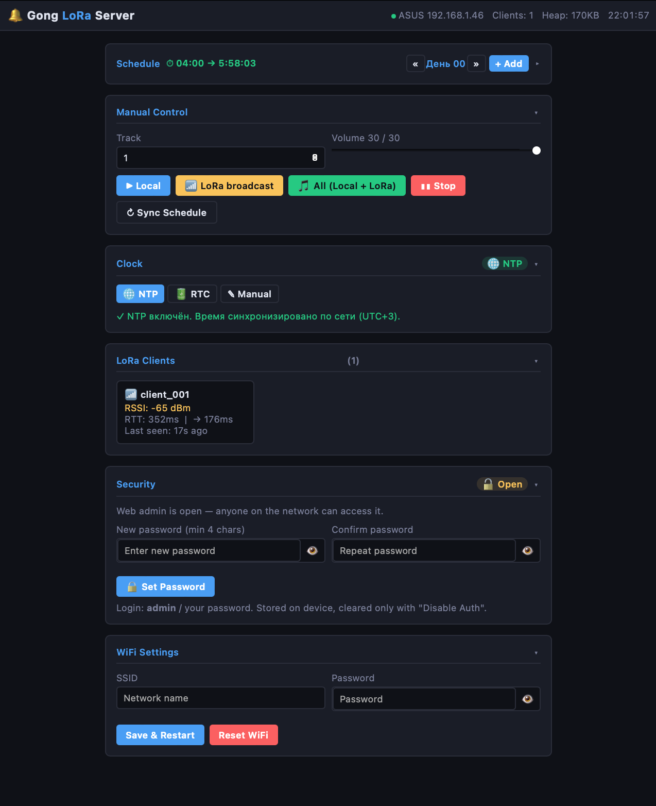
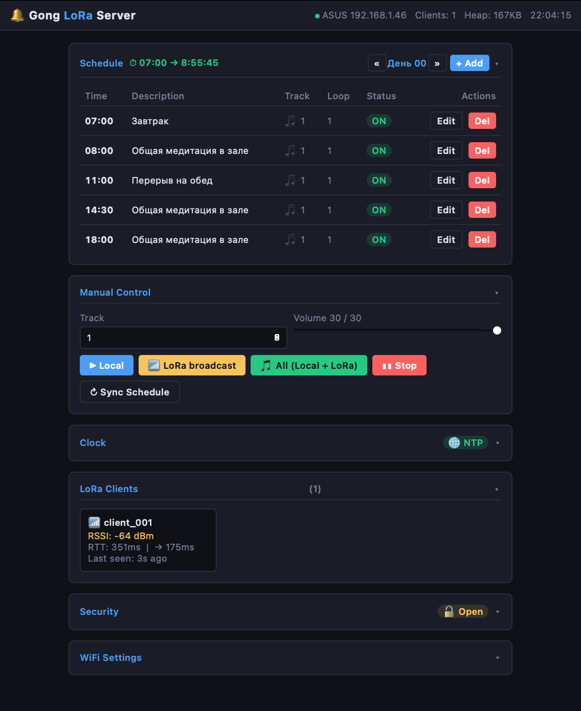
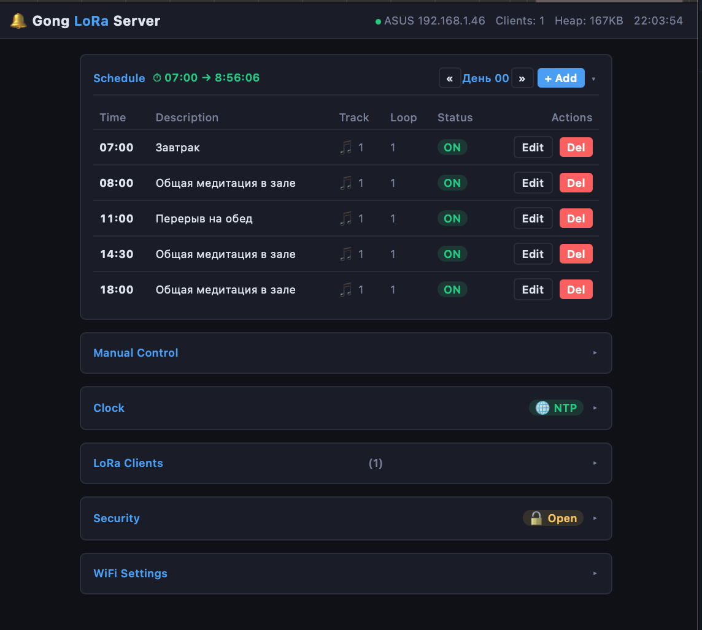

# Gong LoRa System

Автономная система гонга для курсов (изначально — под 12-дневный курс Випассаны):
один **сервер** с расписанием и веб-интерфейсом, и произвольное число
**клиентов**, которые слышат сервер по LoRa (433 МГц) и синхронно проигрывают
трек через MAX98357A. Ни сервер, ни клиенты не подключаются к интернету и не
зависят от роутера — сервер сам поднимает точку доступа Wi-Fi для веб-интерфейса,
а сервер↔клиент общаются напрямую по радио.

> Этот README описывает код и схему **как они есть в этом репозитории прямо
> сейчас**. Более ранняя версия README (до коммита `415825b`, «strip
> LoRa/client to keep server as WiFi-only») описывала WiFi STA + NTP +
> `MSG_SCHEDULE` как «просто лог» — ничего из этого в текущей прошивке нет.
> Если у вас уже распаяна плата по инструкциям из старого README — сверьте
> распиновку LoRa DIO0 ниже, это единственное расхождение, которое
> физически ломает связь без единой ошибки в логе.

---

## 1. Как это работает

```
┌──────────────────────┐         LoRa 433MHz          ┌──────────────────────┐
│        SERVER         │◄─────────────────────────────►│        CLIENT ×N      │
│  ESP32 + Ra-02 + I2S   │   HEARTBEAT / GONG / STOP /   │  ESP32 + Ra-02 + I2S   │
│  + DS3231 + Wi-Fi AP   │   SCHEDULE (binary, signed)   │                        │
└──────────┬─────────────┘                                └──────────┬─────────────┘
           │ Wi-Fi AP (192.168.4.1)                                   │
           ▼                                                           ▼
   Веб-интерфейс (браузер)                                    Динамик (MAX98357A)
```

- **Сервер** держит расписание (`/gong.conf` + шаблоны дней `/dayNN.conf`),
  раздаёт веб-интерфейс со своей же точки доступа, и в момент срабатывания
  записи шлёт по LoRa подписанный кадр `GONG` — все клиенты в радиусе слышат
  его и запускают тот же трек практически одновременно с сервером.
- **Клиент** — минимальное устройство без экрана и кнопок: слушает эфир,
  проверяет подпись, проигрывает MP3 с локальной SPIFFS/LittleFS. Раз в
  30 секунд отвечает на heartbeat сервера, чтобы попасть в список «живых
  клиентов» в веб-интерфейсе.
- **Если сервер замолкает** (перезагрузка, авария) дольше 10 минут, клиент
  переходит на **автономное расписание**, которое сервер заранее разослал по
  радио (см. §7) — курс не срывается из-за одного сбойного устройства.

---

## 2. Аппаратная часть

### 2.1 Общая для сервера и клиента распиновка

| Функция      | GPIO | Комментарий |
|---|---|---|
| LoRa NSS     | 5    | Strapping-пин — обязателен pull-up 10 кОм → 3.3V (см. §2.4) |
| LoRa RST     | 14   | MTMS/JTAG — pull-up 10 кОм → 3.3V + 100 нФ → GND рекомендован при длинных проводах |
| **LoRa DIO0**| **4**| **Не GPIO2!** GPIO2 — strapping-пин со встроенным синим светодиодом на многих DevKit-платах, мешает загрузке. Если прервано на GPIO2 — SPI-инициализация пройдёт успешно, пакеты будут физически приходить, но прерывание никогда не сработает: **полная тишина без единой ошибки в логе.** |
| LoRa SCK/MISO/MOSI | 18/19/23 | штатный VSPI |
| I2S BCLK     | 26   | MAX98357A |
| I2S LRC      | 25   | MAX98357A |
| I2S DOUT     | 33   | MAX98357A. На части плат GPIO32/33 разведены под внешний кварц 32.768 кГц — если на вашей плате он распаян, DOUT на 33 не заработает; проверьте конкретную ревизию. |
| I2C SDA/SCL  | 21/22| DS3231 (**только сервер**) |
| Status LED (клиент) | 13 | см. §2.5; `-1` отключает |

### 2.2 LoRa-модуль: Ra-01 или Ra-02 (SX1278)

Электрически идентичны — Ra-02 просто добавляет SMA-разъём под внешнюю
антенну. Модуль **не** выводит DIO1 (только DIO0 на стандартном 2×4
разъёме) — см. `footprint/lora-01.txt`. Отсюда одно прямое следствие: любая
защита от коллизий эфира, основанная на CAD (Channel Activity Detection),
здесь физически невозможна без замены модуля — прошивка вместо этого решает
проблему коллизий детерминированными тайм-слотами ACK (см. §6).

**⚠️ Не подавать питание на модуль, пока не подключена антенна.** Работа
выходного каскада SX1278 на разомкнутый выход необратимо выводит его из
строя.

Радиопараметры (заданы в `common/lora_shared.h`, ОБЯЗАНЫ совпадать на
сервере и всех клиентах — расхождение не даёт ошибки, просто устройства
перестают слышать друг друга):

| Параметр | Значение |
|---|---|
| Частота | 433.0 МГц |
| Spreading Factor | SF7 |
| Bandwidth | 125 кГц |
| Coding Rate | 4/5 |
| TX Power | 17 дБм (50 мВт ERP) |

> 17 дБм превышает типичный лимит 10 мВт ERP для ISM 433 МГц в EU/РФ
> примерно в 5 раз. Для стационарной системы в одном здании это осознанный
> компромисс ради дальности и устойчивости связи — но это компромисс,
> который стоит зафиксировать сознательно, а не унаследовать по умолчанию.

### 2.3 MAX98357A (I2S-усилитель, 3 Вт @ 4 Ω)

- **SD → 1 МОм на VDD** (не на землю и не напрямую на 3.3V!). SD одновременно
  и «shutdown», и селектор канала по уровню напряжения; перемычка на 3.3V
  даёт «только левый канал». Резистор 1 МОм (с внутренней подтяжкой чипа
  100 кОм к земле) даёт ~0.3–0.45 В на SD → режим (L+R)/2.
- **GAIN**: в этой схеме оставлен висящим (NC) → 9 дБ. Альтернативы: GND напрямую
  (15 дБ), 100 кОм→GND (12 дБ), 100 кОм→VDD (6 дБ), VDD напрямую (3 дБ).
  Выбор нужно зафиксировать письменно вне зависимости от значения — «не
  подключено» здесь такое же осознанное решение, как и любое другое.
- **Выход мостовой (BTL)** — ни один вывод динамика нельзя сажать на землю,
  «минусы» двух усилителей объединять нельзя.
- **Отдельное сильноточное питание.** При максимальной громкости пиковый
  ток может доходить до 1.2–1.5 А — дорожки/защитный диод/USB-разъём
  типовой dev-платы на это не рассчитаны; просадка в момент удара гонга даёт
  brownout-перезагрузку ESP32 ровно тогда, когда должен звучать звук. См.
  `footprint/schematic_netlist.md` — там уже разведено отдельное 5В-питание с
  ферритовой развязкой (FB1) между цифровой и аудио-секцией, плюс bulk-ёмкости
  у обеих секций.
- Провода к динамику — витая пара, не длиннее 1-2 м, ферритовая бусина на
  выходе (Class-D шумит на частоте коммутации ~300 кГц и наводится на приёмник
  433 МГц в том же корпусе).

### 2.4 Discrete-доработки (сервер, см. `footprint/schematic_netlist.md`)

| Что | Зачем |
|---|---|
| Pull-up 10 кОм NSS → 3.3V | SX1278 не видит SPI-мусор, пока ESP32 грузится |
| Pull-up 10 кОм RST → 3.3V + 100 нФ → GND | гасит звон при длинных проводах к модулю |
| SD MAX98357A → 1 МОм → VDD | режим (L+R)/2 вместо «только левый канал» |
| GAIN — задокументированный выбор | см. §2.3 |

### 2.5 DS3231 (RTC) — только сервер, **обязателен**, не опционален

Сервер работает исключительно как автономная точка доступа — NTP в прошивке
нет вообще. Без DS3231 время сбрасывается при каждом отключении питания,
расписание блокируется до ручной установки времени через веб-интерфейс, а
автопереход по дням курса (`dayNN.conf`) завязан именно на календарную дату.

⚠️ **Батарейка.** Дешёвые модули ZS-042 имеют встроенную цепь подзарядки под
LIR2032. Обычный CR2032 в такой цепи постоянно «подзаряжается» — вздутие,
течь, в пределе разрушение модуля. Либо выпаять зарядный резистор на модуле
(маркирован `R5`/`201`), либо ставить перезаряжаемый LIR2032.

### 2.6 Статусный светодиод клиента

Клиент — устройство без экрана, сети и кнопок; понять «жив ли он, слышит ли
сервер» без ноутбука по USB можно только по этому светодиоду
(`client/src/config.h: STATUS_LED`, по умолчанию GPIO13):

| Индикация | Значение |
|---|---|
| 4 коротких мигания при старте | загрузка прошла |
| Быстрое непрерывное мигание (~5 Гц) | радио не инициализировалось — проверьте пайку/DIO0 |
| Одно короткое мигание раз в 3 с | норма, heartbeat получен недавно |
| Двойное мигание раз в 3 с | heartbeat не приходил > 10 минут — клиент работает по автономному расписанию (§7) |
| Горит непрерывно | сейчас играет трек |

### 2.7 Питание и заземление (сервер, HLK-10M05 5В/2-3А)

Схема в `footprint/schematic_netlist.md` реализует:
- отдельный БП 5В с достаточным запасом по току;
- заземление звездой в одной точке;
- 1000 мкФ у входа платы, 470–1000 мкФ у VDD усилителя (короткими дорожками),
  100 мкФ+100 нФ у 3.3V ESP32, 100–220 мкФ+100 нФ у VCC LoRa-модуля;
- ферритовую развязку (FB1) аудио-секции от цифровой 5V-шины.

Проверка после сборки: осциллограф на 3.3V во время удара гонга при
максимальной громкости — просадка ниже 3.0V означает brownout.

---

## 3. Прошивка и загрузка

Оба проекта — независимые PlatformIO-окружения (`server/`, `client/`).

```bash
# Ключ HMAC — ОБЯЗАТЕЛЬНО одинаковый на сервере и ВСЕХ клиентах.
# Без него в config.h остаётся плейсхолдер (прошивка соберётся, но громко
# предупредит в логе и в /api/status) — минимум 16 символов.
export GONG_KEY='замените-на-свой-секретный-ключ-минимум-16-символов'

cd server
pio run -t upload       # прошивка
pio run -t uploadfs      # данные (index.html, .conf, mp3) — LittleFS!

cd ../client
# Один из двух способов различать клиентов:
#  а) ничего не делать — ID выводится из MAC-адреса автоматически (по
#     умолчанию, см. H-6 в 02_FIXES.md — раньше дефолт легко забывали менять
#     на втором устройстве, и оба клиента сливались в одну запись сервера);
#  б) задать говорящее имя: раскомментировать CLIENT_ID_OVERRIDE в config.h.
pio run -t upload
pio run -t uploadfs
```

Чтобы включить ключ из `GONG_KEY` в сборку, раскомментируйте строку
`-DLORA_HMAC_KEY=...` в `build_flags` соответствующего `platformio.ini`.
Если не включать — прошивка соберётся с плейсхолдером-предупреждением
(`change_me_before_deploy_32chars!`), что тоже валидно для стенда/разработки,
но не для реального курса.

**Файловая система — LittleFS, не SPIFFS.** SPIFFS в arduino-esp32 — legacy:
деградирует по мере заполнения, нет директорий, лимит имени 32 символа, и
хуже переживает потерю питания посреди записи — а питание здесь пропадает
регулярно (это и есть причина существования watchdog/self-heal в прошивке).
`pio run -t uploadfs` форматирует раздел под LittleFS автоматически.

### Обновление веб-интерфейса

`server/data/index.html` отдаётся в сжатом виде, если рядом лежит
`index.html.gz` (41 КБ → ~9 КБ — заметно быстрее по Wi-Fi AP). После правки
`index.html` пересоздайте архив перед `uploadfs`:

```bash
cd server/data && gzip -9 -k -f index.html
```

---

## 4. Веб-интерфейс сервера

После прошивки поднимается точка доступа `GongServer` (пароль —
`AP_PASSWORD` в `server/src/config.h`), интерфейс — `http://192.168.4.1` или
`http://gong.local` (mDNS).

- **Schedule** — расписание активного дня курса; можно листать дни курса
  вперёд/назад (только просмотр, `GET /api/day?n=N`, ничего не переключает)
  и явной кнопкой «Activate this day» переключить активный шаблон.
- **Clock** — источник времени: RTC (DS3231) или ручной ввод. Расписание не
  работает, пока время не установлено (часы показывают `--:--:--`).
- **Security** — пароль администратора (PBKDF2-SHA256, см. §8), по умолчанию
  выключен — интерфейс открыт всем на точке доступа.
- **LoRa** — список клиентов, увиденных за последние 90 секунд (RSSI, SNR,
  время последнего ответа), ручное проигрывание (локально / по радио / оба).

Один запрос `/api/state` раз в 5 секунд обновляет все карточки разом — это
не пять параллельных запросов, как было раньше (см. §9, M-10): однопоточный
`WebServer` ESP32 обслуживает одно соединение за раз, и пять запросов подряд
на каждый тик означали, что реальное действие оператора (правка расписания)
вставало в очередь позади поллинга и срабатывало с задержкой в минуты.

---

## 5. Многодневный курс (`dayNN.conf`)

Ключевая функция системы — не задокументированная вообще в исходном README.
12 «шаблонов дня» (`/day00.conf` … `/day11.conf`, `DAY_COUNT` в `config.h`):
`day00` = день заезда, `day01`–`day10` — одинаковый «боевой» распорядок,
`day11` = день отъезда. «День» — номер дня курса, не день недели и не
календарная дата.

- `/gong.conf` — активное расписание, реально проверяемое рантаймом.
- `/activeday.conf` — `{"day": N, "date": "YYYY-MM-DD"}`, какой шаблон активен
  и на какую календарную дату он был активирован.
- Автопереход на следующий день срабатывает по смене календарной даты (не по
  тику «00:00»), и переходит сразу на нужное число дней вперёд, если
  устройство было выключено несколько суток подряд (не залипает на +1).
- Каждая запись расписания несёт трек, число повторов **и громкость** — тихий
  подъём в 04:00 и громкий общий сбор в 08:00 можно задать по-разному.
- **После `day11` автоперехода нет** — это осознанное поведение, не баг:
  устройство остаётся на дне 11 (лог: «course ended, staying on day 11»), в
  вебе видна плашка «Курс завершён». Для нового заезда активируйте `day00`
  вручную — кнопкой «Activate this day».

---

## 6. Протокол LoRa

Кадр: `[1 байт тип][8 байт HMAC-SHA256/32 тег][payload]`. Тег — на
фиксированном смещении, считается напрямую по байтам, ушедшим в эфир — без
пересборки JSON на приёмнике (более ранняя схема подписывала JSON строковой
хирургией и проверяла через parse→remove→re-serialize, что работало только
пока порядок полей совпадал побайтово).

| Тип | Кто шлёт | Подписан | Payload |
|---|---|---|---|
| `GONG` (0x01) | сервер | да | JSON: track/vol/loop/ts/n |
| `HEARTBEAT` (0x02) | сервер | да | JSON: time/clients/ts/n/seq |
| `SCHEDULE` (0x03) | сервер | да | бинарный: ts + n + до 16 записей активного дня |
| `ACK` (0x04) | клиент | да | JSON: id/rssi/[hb] |
| `STOP` (0x05) | сервер | да | JSON: ts/n |

- **Anti-replay**: `ts` — монотонная метка (реальное время либо
  NVS-подстрахованный аптайм на сервере), клиент отбрасывает всё
  `ts < последний_виденный`, значение сохраняется в NVS — переживает
  перезагрузку клиента. `ts` даёт разрешение в 1 секунду — этого мало,
  чтобы отличить, например, Stop сразу после Play; `n` — простой счётчик
  отправок за это включение сервера (не переживает его перезагрузку, это и
  не нужно — `ts` уже гарантированно прыгает вперёд после ребута) — разбивает
  кадры с одинаковым `ts` по порядку: кадр принимается, если `ts` больше
  последнего виденного, либо `ts` тот же, а `n` больше.
- **Коллизии ACK**: клиент отвечает в детерминированном слоте, вычисленном
  из хеша своего `CLIENT_ID` (`ACK_SLOT_COUNT=16`, `ACK_SLOT_MS=120`) —
  вместо случайного джиттера 0–70 мс, который на SF9 (~288 мс airtime ACK)
  гарантированно накладывался уже при двух клиентах. ACK на `GONG` не
  отправляется вовсе — сервер его не использует, а держать эфир занятым
  ровно тогда, когда следом может прийти `STOP`, было лишним риском.
- **Локальное проигрывание — не блокирует.** И на сервере, и по всей цепочке
  TX — асинхронно: планировщик шлёт кадр в очередь и продолжает работать;
  локальный трек стартует, когда фактически завершилась передача (или истёк
  таймаут), а не когда кто-то полсекунды ждал в цикле.

---

## 7. Автономный режим клиента (резервное расписание)

Самый тяжёлый операционный риск исходной системы: сервер — единая точка
отказа, и его смерть ночью означала, что подъём в 04:00 не прозвонит нигде.

Решение: сервер рассылает расписание активного дня в бинарном виде (влезает
в один LoRa-кадр — то же расписание в JSON, ~3.4 КБ, никогда бы не влезло) —
при активации дня и раз в час. Клиент хранит его в NVS вместе с виртуальными
часами, которые синхронизирует по полю `time` из каждого heartbeat (у клиента
нет RTC — точность ровно такая, какой была последняя heartbeat).

Если heartbeat не приходил дольше 10 минут (`HEARTBEAT_LOST_MS`), клиент
переходит на автономное расписание и звонит по нему сам, раз в минуту сверяя
виртуальные часы с сохранённым расписанием. Как только heartbeat вернулся —
клиент снова становится ведомым (чтобы не звонить дважды).

---

## 8. Безопасность

- **HMAC-ключ** (`LORA_HMAC_KEY`) — без него любой, у кого есть Ra-02 и этот
  репозиторий, может позвонить в гонг когда угодно. Плейсхолдер в
  `config.h` собирается (чтобы проект работал «из коробки» на стенде), но
  громко предупреждает в логе и в `/api/status` (`default_key: true`).
- **Пароль администратора** — PBKDF2-SHA256, 20000 итераций, случайная соль
  16 байт, константное по времени сравнение. Хранится в `/auth.conf` как
  `{"salt","hash","iter"}` — не как открытый текст.
- **CSRF**: у веб-интерфейса нет CORS (незачем — он same-origin), но все
  изменяющие запросы должны нести заголовок `X-Gong-Request: 1`, который
  сторонняя страница выставить не может без CORS-preflight, а preflight
  ничем не отвечен.

---

## 9. Известные ограничения

- Нет OTA — обновление каждого клиента требует физического USB-подключения.
- Автономное расписание клиента ограничено 16 записями активного дня и живёт
  только по виртуальным часам от последнего heartbeat — не замена RTC.
- Радиорегуляторика: TX Power 17 дБм превышает типичный лимит для ISM
  433 МГц в EU/РФ — см. §2.2.
- Тестов и CI нет.

---

## 10. Структура репозитория

```
server/         прошивка сервера (PlatformIO)
client/         прошивка клиента (PlatformIO)
common/         lora_shared.h — общие RF-константы, типы сообщений, формат кадра
footprint/      схема (EasyEDA JSON), netlist, черновая расстановка PCB
images/         скриншоты веб-интерфейса, пиноут MAX98357A
01_AUDIT_REPORT.md   аудит проекта — блокеры/риски/находки
02_FIXES.md          конкретные патчи по каждому пункту аудита
```

---

## Скриншоты




