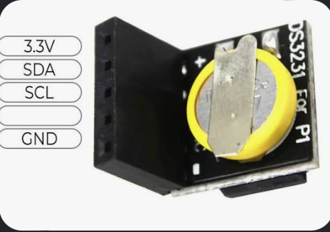

# Распиновка — ветка `standalone-max` (FW 6.2-max)

Одиночный гонг: ESP32-DevKitC-V4 (38 pin) + усилитель MAX98357A на динамик + часы реального времени **DS3231 For Pi** (мини-модуль под Raspberry Pi).
Реле, светодиода, кнопки и LoRa в этой версии нет — управление только через веб-интерфейс по Wi-Fi.

Та же схема с рисунком встроена в прошивку: `http://gongN.local/info` (N — номер устройства) (исходник [server/web/info.html](../server/web/info.html)).
Пины в прошивке — [server/src/config.h](../server/src/config.h). Питание — [power.md](power.md).

Плата нарисована сверху: антенна вверху, USB внизу. Пин 1 каждого ряда — у антенны, пин 19 — у USB.
Нумерация — по Espressif ESP32-DevKitC-V4 Getting Started Guide.

> Порядок выводов на модулях MAX98357A и DS3231 у разных продавцов разный.
> Подключать **по надписям на своём модуле**. Перед подачей питания проверить на DevKit:
> 3V3 — левый пин 1, 5V — левый пин 19.

---

## 1. Сводная таблица

| Сигнал | GPIO | Пин DevKit | Модуль | Вывод модуля |
|---|---|---|---|---|
| I2S BCLK | 26 | левый 10 | MAX98357A | BCLK |
| I2S LRC (WS) | 25 | левый 9 | MAX98357A | LRC |
| I2S DATA | 33 | левый 8 | MAX98357A | DIN |
| +5 В | — | левый 19 (5V) | MAX98357A | Vin |
| GND | — | левый 14 | MAX98357A | GND |
| — | — | — | MAX98357A | GAIN — не подключать |
| — | — | — | MAX98357A | SD — не подключать |
| I2C SDA | 21 | правый 6 | DS3231 For Pi | SDA (D) |
| I2C SCL | 22 | правый 3 | DS3231 For Pi | SCL (C) |
| +3.3 В | — | левый 1 (3V3) | DS3231 For Pi | 3.3V (+) |
| GND | — | правый 1 | DS3231 For Pi | GND (−) |
| — | — | — | DS3231 For Pi | NC — не подключать |
| подтяжки | — | — | SDA, SCL | 4.7 кОм к 3.3 В, если их нет на модуле (§3) |

Динамик (4–8 Ом) — на клеммник MAX98357A `+` / `−`.

---

## 2. MAX98357A (I2S-усилитель)

| Вывод | Куда | Примечание |
|---|---|---|
| LRC | GPIO25 | |
| BCLK | GPIO26 | |
| DIN | GPIO33 | |
| GAIN | не подключать | 9 дБ. Варианты: на GND — 12 дБ, на Vin — 6 дБ, через 100 кОм на GND — 15 дБ, через 100 кОм на Vin — 3 дБ |
| SD | не подключать | резистор на модуле выбирает канал; прошивка сводит запись в моно (`forceMono`), поэтому звук полный при любом выборе |
| GND | GND | |
| Vin | 5V | 2.5–5.5 В; полная мощность только от 5 В |
| `+` / `−` | динамик | выход мостовой: ни один провод не соединять с GND |

- 5 В для модуля лучше брать прямо от блока питания, а не через USB DevKit.
- Конденсатор у Vin модуля: 100 нФ керамика + 470–2200 мкФ электролит (расчёт — [power.md](power.md)).
- Громкость ограничена в прошивке: `VOLUME_LIMIT = 25` (−3.5 дБ), см. `config.h`.

---

## 3. Часы DS3231 For Pi

Используется не большой модуль ZS-042, а **DS3231 For Pi** — мини-плата под Raspberry Pi:
чип DS3231, батарейка и 5-контактное гнездо (шаг 2.54 мм), которое на Raspberry Pi
надевается на пины 1, 3, 5, 7, 9. Выходов 32K/SQW и EEPROM на ней нет.



### Подключение

Порядок контактов гнезда повторяет пины Raspberry Pi 1-3-5-7-9. Подписи на плате бывают
`+ D C NC −` или `3.3V SDA SCL NC GND` — **подключать по надписям на своём модуле**.

| Контакт модуля | Как на Raspberry Pi | Куда на ESP32 | Пин DevKit | Примечание |
|---|---|---|---|---|
| 1: 3.3V (`+`) | pin 1, 3.3 В | 3V3 | левый 1 | питание **3.3 В**, не 5 В |
| 2: SDA (`D`) | pin 3, GPIO2 | GPIO21 | правый 6 | |
| 3: SCL (`C`) | pin 5, GPIO3 | GPIO22 | правый 3 | |
| 4: NC | pin 7, GPIO4 | не подключать | — | на модуле никуда не идёт |
| 5: GND (`−`) | pin 9, GND | GND | правый 1 | |

Гнездо модуля — «мама»: к DevKit удобно подключать проводами «мама–мама» не напрямую,
а через штыревую линейку 1×5 или проводами «папа–мама».

### Подтяжки I2C — проверить

На Raspberry Pi подтяжки 1.8 кОм стоят на самой плате Pi, поэтому на модулях For Pi
своих резисторов на SDA/SCL **обычно нет**. У ESP32 встроенные подтяжки слабые (~45 кОм) —
на коротких проводах часы могут читаться, но со сбоями (в логе `Implausible DS3231 read`
или `DS3231 not found`).

Проверка: мультиметром при выключенном питании сопротивление между SDA и `+`, SCL и `+`.
- Несколько кОм — подтяжки на модуле есть, ничего не добавлять.
- Обрыв или сотни кОм — поставить **4.7 кОм от SDA к 3.3 В и 4.7 кОм от SCL к 3.3 В** (у ESP32 или у модуля).

На шине одно устройство: **DS3231 — адрес 0x68**.
В прошивке: `Wire.begin()` на штатных пинах 21/22, библиотека RTClib (`server/src/rtchandler.cpp`).
Для DS3231 For Pi прошивку менять не нужно — чип тот же.

### Батарейка

- Батарейка (таблетка в жёлтой плёнке) **припаяна к модулю лепестками**, держателя нет —
  замена только пайкой. Держит ход часов при выключенном питании.
- Тип посмотреть по надписи на ней (под плёнкой). Если это аккумулятор (`LIR…`), менять только на такой же;
  если обычная литиевая (`CR…`) — проверить, нет ли на модуле цепи подзарядки (диод + резистор от 3.3 В
  к батарейке); при наличии — выпаять, иначе батарейка вздуется.
- Если батарейка села, при включении в логе `DS3231 found but lost power`, время не считается действительным.

### Как прошивка использует часы

- DS3231 хранит время в **UTC**; местное время получается через часовой пояс `TIME_TZ` (по умолчанию `MSK-3`, UTC+3) в `config.h`.
- Источник времени выбирается автоматически:
  1. **NTP** — если ESP32 подключён к роутеру с интернетом; опрос раз в час, каждое успешное время сразу записывается в DS3231.
  2. **DS3231** — при загрузке и раз в час, если NTP не отвечал больше 2 ч (или роутера нет). Заодно убирает дрейф кварца ESP32.
  3. **Вручную** из веб-интерфейса (карточка Clock) — если нет ни интернета, ни DS3231 с верным временем; тоже записывается в DS3231.
- Показания с явным мусором (сбой шины I2C: год вне 2024–2099 или два чтения подряд расходятся больше чем на 2 с; в логе `Implausible DS3231 read`) отбрасываются.
- **Без действующего времени гонги не звучат** — в вебе красная плашка «Время не установлено».
- Не стирать NVS целиком (`pio run -t erase`): пропадёт отметка о переводе DS3231 на UTC, и после загрузки время сдвинется на 3 часа.

### Если часы не работают

| Признак | Что проверить |
|---|---|
| В логе `DS3231 not found` | провода SDA/SCL (не перепутаны ли 21 и 22), питание 3.3 В, GND, подтяжки SDA/SCL |
| `lost power` после каждого выключения | батарейка села или отошёл припаянный лепесток — проверить напряжение на батарейке (норма 2.8–3.3 В) |
| Время то есть, то `Implausible DS3231 read` / пропадает | нет подтяжек на SDA/SCL — поставить 4.7 кОм к 3.3 В |
| Время сдвинуто на 3 ч | менялся `TIME_TZ` или стирали NVS — установить время заново |

## 4. ESP32-DevKitC-V4 — все 38 выводов

| № | Левый ряд | Подключено | Правый ряд | Подключено |
|---|---|---|---|---|
| 1 | 3V3 | **DS3231 3.3V** | GND | **DS3231 GND** |
| 2 | EN | — | GPIO23 | свободен |
| 3 | GPIO36/VP | свободен (только вход) | GPIO22 | **DS3231 SCL** |
| 4 | GPIO39/VN | свободен (только вход) | GPIO1/TX0 | USB-Serial, не трогать |
| 5 | GPIO34 | свободен (только вход) | GPIO3/RX0 | USB-Serial, не трогать |
| 6 | GPIO35 | свободен (только вход) | GPIO21 | **DS3231 SDA** |
| 7 | GPIO32 | свободен | GND | — |
| 8 | GPIO33 | **MAX98357A DIN** | GPIO19 | свободен |
| 9 | GPIO25 | **MAX98357A LRC** | GPIO18 | свободен |
| 10 | GPIO26 | **MAX98357A BCLK** | GPIO5 ⚠ | strapping, лучше не использовать |
| 11 | GPIO27 | свободен | GPIO17 | свободен |
| 12 | GPIO14 | свободен | GPIO16 | свободен |
| 13 | GPIO12 ⚠ | не трогать (strapping) | GPIO4 | свободен |
| 14 | GND | **MAX98357A GND** | GPIO0 ⚠ | не трогать (Boot) |
| 15 | GPIO13 | свободен | GPIO2 ⚠ | не трогать (strapping) |
| 16 | GPIO9/SD2 | не трогать (flash) | GPIO15 ⚠ | не трогать (strapping) |
| 17 | GPIO10/SD3 | не трогать (flash) | GPIO8/SD1 | не трогать (flash) |
| 18 | GPIO11/CMD | не трогать (flash) | GPIO7/SD0 | не трогать (flash) |
| 19 | 5V | **MAX98357A Vin** | GPIO6/CLK | не трогать (flash) |

Свободные выводы общего назначения: 4, 13, 14, 16, 17, 18, 19, 23, 27, 32; только вход: 34, 35, 36, 39.
В ветке `standalone` на 27 было реле, на 13 — светодиод, на 32 — кнопка; здесь они не используются.

---

## 5. Питание

```
220 В ─ HLK-PM01 / HLK-10M05 ─ +5 В ─┬─ DevKit 5V (левый 19)
                                     └─ MAX98357A Vin (+ конденсатор 470–2200 мкФ)
DevKit 3V3 (левый 1) ─ DS3231 For Pi 3.3V (+ подтяжки SDA/SCL 4.7 кОм, если нужны)
Общий GND: блок питания, DevKit, MAX98357A, DS3231 For Pi
```

- При прошивке по USB с подключённым блоком питания 5 В от USB может попасть на выход блока
  (см. `footprint/PCB_WORKLOG.md`, P5). Надёжнее отключать блок от сети на время прошивки
  или ставить на линию 5 В диод Шоттки (SS34).
- Без блока питания, от одного USB, усилитель тоже заработает, но громкий гонг может просадить USB —
  для проверки звука ставьте громкость пониже.
- Выбор блока питания — [power.md](power.md): HLK-PM01 хватает при `VOLUME_LIMIT = 25`, для полной громкости на 4 Ом — HLK-10M05.
